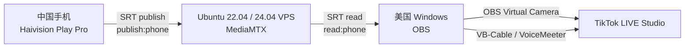

# TikTok SRT Relay

版本：`1.0.0`

本仓库是 VPS 侧 SRT 中转服务：负责 MediaMTX 配置、多路推流管理、以及向中控台上报状态。中控台 Hub 页面和多机看板已拆分到独立项目 `tiktok-srt-monitor`。

一个只负责 `SRT` 中转的轻量 VPS 方案：

- 中国手机端使用 `Haivision Play Pro` 推 `SRT` 到 Ubuntu VPS
- 美国 Windows 电脑上的 `OBS` 从 VPS 拉 `SRT`
- `OBS Virtual Camera + VB-Cable / VoiceMeeter` 再把画面和声音交给 `TikTok LIVE Studio`

本项目不会实现 TikTok API，不会获取 TikTok stream key，也不会在 VPS 上运行桌面环境、OBS 或 LIVE Studio。

如果你想直接按步骤操作，优先看 [TUTORIAL.zh-CN.md](./TUTORIAL.zh-CN.md)。

当前实测推荐客户端：

- 手机推流：`Haivision Play Pro`
- Windows 拉流：`OBS`
- 开播：`TikTok LIVE Studio`

当前实测稳定参数：

- 手机端 `Haivision Play Pro` 延迟：`500`
- OBS 拉流 `latency`：`500000`

## 架构图



## 文件说明

- `docker-compose.yml`：使用 Docker Compose 运行 `MediaMTX`
- `mediamtx.yml.template`：配置模板
- `.env.example`：环境变量样例
- `scripts/setup.sh`：安装依赖、生成配置、开放防火墙、启动服务
- `scripts/render-config.sh`：读取 `.env` 渲染 `mediamtx.yml`
- `scripts/status.sh`：查看容器状态、日志、监听端口
- `scripts/test-publish.sh`：本机推送测试流
- `scripts/test-read.sh`：本机拉流验证
- `scripts/manage.py`：交互式管理多路推流（增删/查看连接信息/重启）

## 一键安装

```bash
curl -fsSL https://raw.githubusercontent.com/xinzongTT/tiktok-srt-relay/master/install.sh | sudo bash
```

## 手动安装

`setup.sh` 完成后会打印两条关键地址：

- `Phone publish URL`
- `OBS read URL`

同时会生成：

- `.env`
- `mediamtx.yml`

## 查看状态

```bash
bash scripts/status.sh
```

你应该重点关注：

- `docker ps` 中存在 `tiktok-srt-relay`
- 日志里出现 `SRT listener opened on :8890`
- `ss -lunp` 里出现 UDP `8890`

## 测试

```bash
# 终端 1
bash scripts/test-publish.sh

# 终端 2
bash scripts/test-read.sh
```

如果链路正常，`test-read.sh` 会持续读取约 10 秒并正常退出。

## 手机推流客户端

推荐优先使用 `Haivision Play Pro`。

说明：

- 本次实测中，`Haivision Play Pro` 已验证可以稳定推送到 `MediaMTX`
- `Moblin` 虽然能建立连接，但在当前环境下出现持续 `decode errors`

手机推流参数详见 [TUTORIAL.zh-CN.md](./TUTORIAL.zh-CN.md)。

## 美国 OBS 设置

1. 添加 `Media Source`
2. 取消 `Local File`
3. `Input` 填 `setup.sh` 打印出来的 `OBS read URL`
4. `Input Format` 填 `mpegts`
5. `Network buffering` 可按实际情况调整；低延迟建议优先从 OBS 读流 `latency` 和手机端 `SRT` 延迟入手
6. `OBS` 画布建议竖屏：
   - `Base Canvas`：`1080x1920` 或 `720x1280`
   - `Output`：`1080x1920` 或 `720x1280`
7. 点击 `Start Virtual Camera`

## OBS 音频到 TikTok LIVE Studio

1. Windows 安装 `VB-Cable` 或 `VoiceMeeter`
2. `OBS Settings > Audio > Advanced > Monitoring Device` 选择 `CABLE Input`
3. `OBS Advanced Audio Properties` 里，把手机流音频设置为 `Monitor and Output`
4. `TikTok LIVE Studio` 麦克风选择 `CABLE Output`
5. `TikTok LIVE Studio` 摄像头选择 `OBS Virtual Camera`

## TikTok LIVE Studio 设置

- 摄像头选择 `OBS Virtual Camera`
- 麦克风选择 `CABLE Output`
- 在正式开播前先做一次私密或测试直播
- 检查画面是否竖屏正确铺满，声音电平是否稳定

## 验收步骤

1. 执行 `bash scripts/status.sh`
2. 确认日志里能看到 `SRT listener opened on :8890`
3. 中国手机开始推流
4. 再次查看日志，确认出现 `is publishing to path 'phone'`
5. 美国 `OBS` 中确认能看到画面和声音
6. `TikTok LIVE Studio` 中确认能看到 `OBS Virtual Camera` 画面
7. `TikTok LIVE Studio` 麦克风电平有声音
8. 进行至少 `20` 分钟测试直播，确认不中断

## 修改配置

如果需要修改 `.env`，例如调整默认延迟：

```bash
bash scripts/render-config.sh
docker compose restart
```

## 多路推流管理

```bash
bash scripts/manage.sh
```

交互式菜单：查看所有流、新增流（自动生成密码）、删除流、重启服务。

更快捷：SSH 进服务器后加个别名，以后直接敲 `manage` 即可：

```bash
echo "alias manage='cd /opt/tiktok-srt-relay && bash scripts/manage.sh'" >> ~/.bashrc
source ~/.bashrc
```

常见可调参数：

- `PUBLIC_HOST`：服务器公网 IP 或域名
- `STREAM_PATH`：默认是 `phone`
- `SRT_PORT`：默认是 `8890`
- `SRT_PUBLISH_LATENCY`：默认是 `500`
- `SRT_READ_LATENCY`：默认是 `500000`
- `SRT_PUBLISH_PASSPHRASE`
- `SRT_READ_PASSPHRASE`

## 常见问题排查

### 1. OBS 黑屏

- 确认手机已经开始推流
- 执行 `bash scripts/status.sh` 看日志
- 检查 `OBS URL` 的 `streamid` 是 `read:phone`
- 检查 `passphrase` 是 `SRT_READ_PASSPHRASE`，不是推流密码
- `OBS Input Format` 必须填 `mpegts`

### 2. 手机推不上

- VPS 云厂商安全组是否开放 `UDP 8890`
- VPS 本机 `ufw` 是否开放 `UDP 8890`
- 手机端 `Stream ID` 必须是 `publish:phone`
- 手机端密码必须是推流密码

### 3. 延迟大或卡顿

- 手机端先把码率控制在 `2500-3000 kbps`
- 手机端 SRT 延迟与 OBS 读流延迟配合调节
- 优先参考完整教程中的低延迟建议

### 4. 有画面没声音

- 手机端必须开启 `microphone/audio`
- `OBS` 媒体源音频是否有电平
- `OBS` 是否把该音频 `Monitor and Output` 到 `VB-Cable`
- `TikTok LIVE Studio` 麦克风是否选择 `CABLE Output`

### 5. TikTok LIVE Studio 看不到 OBS Virtual Camera

- 先启动 `OBS` 的 `Start Virtual Camera`
- 重启 `TikTok LIVE Studio`
- 确认 `OBS` 和 `TikTok LIVE Studio` 都是最新版

## 安全建议

- 推流密码和拉流密码已经分离，不要混用
- 建议只把 `OBS read URL` 发给需要拉流的机器
- 如果怀疑密码泄露，修改 `.env` 后重新执行渲染和重启
- 这个 VPS 只做中转，不建议在同机叠加额外高负载服务

## 推流管理 `tkm`

装完后可直接用 `tkm` 命令打开交互式管理菜单：

```
tkm
```

菜单功能：查看流列表、新增推流、删流、重启服务、更新代码。

## 音乐通道（可选）

用于美国端桌面音频同步回中国播放：

```bash
bash scripts/add-music-channel.sh      # 添加 music 通道
bash scripts/music-push-us.ps1         # 美国端推送桌面音频
bash scripts/music-play-cn.sh          # 中国端播放
```

## 接入中控台

[中控台项目](https://github.com/xinzongTT/tiktok-live-jiankong) 可统一监控多个推流服务器。

Hub 页面不在本仓库内运行；本仓库只提供 VPS 侧 reporter。

在 VPS 上一键安装 reporter，并自动创建 systemd 服务 `tiktok-srt-reporter`：

```bash
curl -fsSL https://raw.githubusercontent.com/xinzongTT/tiktok-srt-relay/master/install-monitor.sh | sudo bash
```

默认上报到 `http://23.238.118.221:9988/api/report`。如果中控台已经通过域名反代，运行时传入反代后的 API 地址：

```bash
curl -fsSL https://raw.githubusercontent.com/xinzongTT/tiktok-srt-relay/master/install-monitor.sh -o /tmp/install-monitor.sh
HUB=https://你的域名/api/report NAME=relay-1 sudo -E bash /tmp/install-monitor.sh
```

脚本会读取 `.env` 中的 `PUBLIC_HOST` 和 `SRT_PORT`，默认访问本机 MediaMTX API：`http://127.0.0.1:9997/v3/paths/list`。如果 MediaMTX API 认证不同，可传入 `MTX_AUTH=user:pass`。

查看 reporter 状态：

```bash
systemctl status tiktok-srt-reporter --no-pager
journalctl -u tiktok-srt-reporter -f
```

新增推流线路时请使用 `tkm` 或 `bash scripts/manage.sh`，脚本会同时写入 `paths` 和 `authInternalUsers.permissions`，避免新线路认证失败。

## 项目结构

```
├── docker-compose.yml          # Docker 编排
├── install.sh                  # 一键安装脚本
├── install-monitor.sh          # 一键接入中控台 reporter
├── mediamtx.yml.template       # MediaMTX 配置模板
├── .env.example                # 环境变量模板
├── .env                        # 实际配置（gitignore）
├── scripts/
│   ├── setup.sh                # 初始化安装
│   ├── manage.py               # 交互式管理菜单
│   ├── render-config.sh        # 配置渲染
│   ├── status.sh               # 状态检查
│   ├── add-music-channel.sh    # 添加音乐通道
│   ├── music-push-us.ps1       # 美国端推送音乐
│   ├── music-play-cn.sh        # 中国端播放音乐
│   ├── reporter.py             # 中控台上报代理
│   ├── reporter-start.sh       # reporter 启动脚本
│   ├── test-publish.sh         # 本地测试推流
│   └── test-read.sh            # 本地测试拉流
└── repos/                      # 第三方参考项目
```
